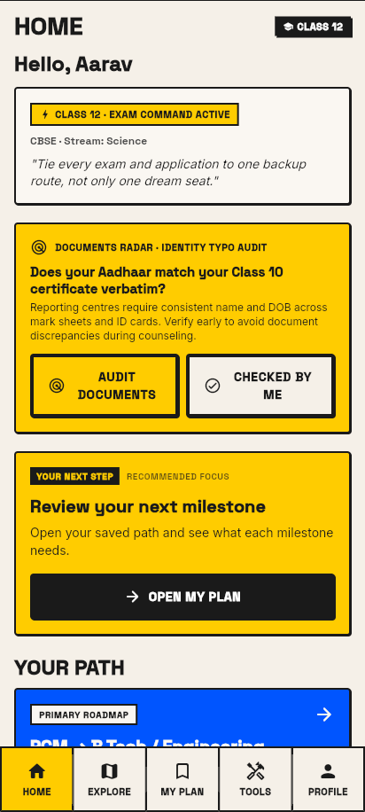
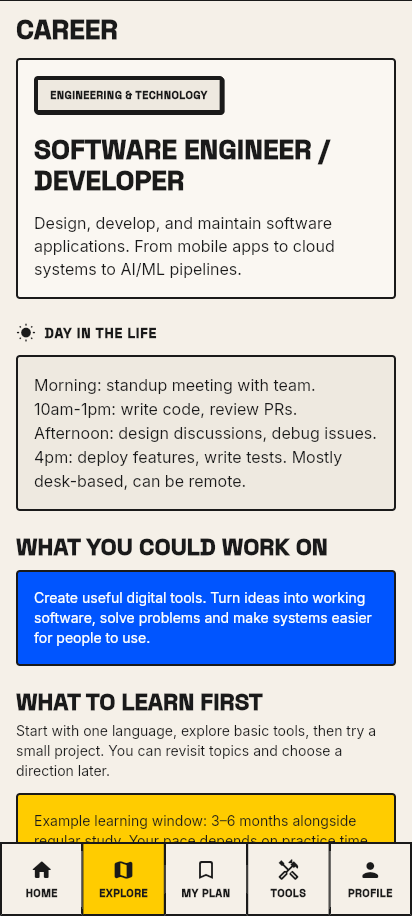
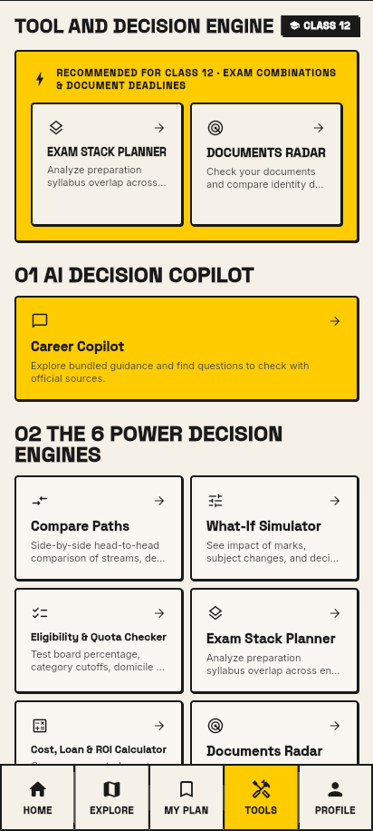
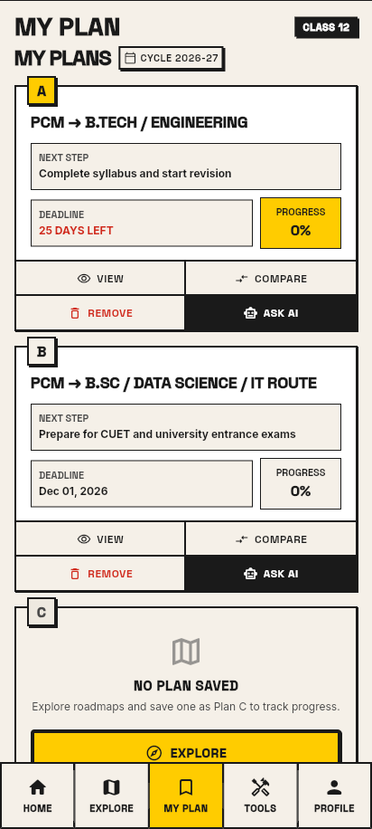

# 🧭 Mārgadarshak — मार्गदर्शक

> *“The one who shows the path.”*  
> **The guide I needed at 16.**  
> A career decision system for Indian students and parents — from Class 9 to postgraduate study.

[](https://github.com/prasadsince1999/MargaDarshak/releases/tag/v1.2.1-preview.1)
[](https://github.com/prasadsince1999/MargaDarshak/releases/tag/v1.2.1-preview.1)
[](#-tech-stack--architecture)
[](#the-non-negotiable-ethical-charter)
[](https://ksmxtech.com/margadarshak/)
[](https://ksmxtech.com/margadarshak/evidence-library/)

Mārgadarshak turns scattered career information into a stage-wise visual map: **stream choices, exams, requirements, institutions, scholarships, documents, costs, practical next steps and backup routes.**

**What can I do now? Which options should I check? What if I change my mind? What is my backup?**

Students explore possibilities. Parents understand the trade-offs. Neither should have to make a life decision from coaching advertisements or half information.

**Subscription-based product in development. No pay-to-rank recommendations. Guest exploration available in the early-test app.** Prices and billing periods will be announced before checkout is available.

Built by [KSM × Tech](https://ksmxtech.com), an independent product studio in India.

---

## 📲 Download & Sideload (Early-Test Android APK)

Mārgadarshak is currently available as a **signed early-test APK** through GitHub Releases. It is not a Play Store launch.

| Release | Artifact | Android | Verification |
|---|---|---|---|
| **1.2.1 · build 4** | [**MargaDarshak-1.2.1-build4-early-test.apk**](https://github.com/prasadsince1999/MargaDarshak/releases/tag/v1.2.1-preview.1) | **7.0+ / API 24** | Release signature and published-file checksum checked |

### How to install

1. Download the APK from the [early-test release](https://github.com/prasadsince1999/MargaDarshak/releases/tag/v1.2.1-preview.1).
2. Open the downloaded file.
3. If Android asks, allow installation from that source and tap **Install**.
4. Launch Mārgadarshak and start as **Guest**.

Local tools and bundled content are useful with unreliable connectivity. Connected Claude guidance, live updates, cloud family sync and subscription checkout are not connected in this preview. Check the relevant official notice before applying.

[**APK checksum**](APK-SHA256.txt) · [**Early-test notes**](EARLY-TEST-NOTES.md) · [**Report an issue**](https://github.com/prasadsince1999/MargaDarshak/issues)

### 📱 Inside the app

Actual Flutter app screens, captured on 7 October 2026 in the browser with a demo Class 12 profile. These are current app views, not reference designs. Dates and salary illustrations are not verified promises.

<table>
<tr><th>Home · A useful next step</th><th>Career · See the work and the possibilities</th></tr>
<tr><td align="center"></td><td align="center"></td></tr>
<tr><td>Relevant questions come into the student's feed instead of waiting for every tool to be discovered.</td><td>Understand daily work, explore learning topics and open a skill or role for more detail.</td></tr>
<tr><th>Tools · Compare before deciding</th><th>My Plan · Main path and a backup</th></tr>
<tr><td align="center"></td><td align="center"></td></tr>
<tr><td>Investigate subjects, requirements and costs using understandable tools.</td><td>Keep alternatives visible. Progress records completed milestones, rather than grading the student.</td></tr>
</table>

---

## The Problem in Indian Public Guidance

Indian students navigate **critical life decisions** — stream selection after Class 10, course choices after Class 12, degree versus diploma, and career routes — through relatives, coaching advertisements, college brochures and scattered notices.

Families need more than a list of career names. They need to understand subjects, requirements, costs, daily work, deadlines and alternatives.

> *“I don't know what to do after 10th or 12th.”*  
> *“I like computers. What can I learn first?”*  
> *“My parents want Engineering, but I want Design — how do we compare?”*  
> *“If this exam does not work out, what is my backup?”*

**The aim:** turn a confusing choice into a clear set of options, a practical next action and a backup worth investigating.

The [evidence library](https://ksmxtech.com/margadarshak/evidence-library/) collects public accounts and records behind these questions. Sources remain subject to review; an anecdote is not an official admission rule or proof that an app would have prevented an outcome.

---

## The Non-Negotiable Ethical Charter

> **No student's future can be sold to the highest-paying institution.**

- **Zero Pay-to-Rank:** institutions cannot buy recommendation order.
- **Transparent Comparisons:** show available information, assumptions and missing data.
- **Open Choices:** offer alternatives instead of forcing one degree or career route.
- **Honest Verification:** a document self-check is not official approval; a practice result is not a career qualification.
- **Student and Parent Agency:** explain trade-offs without shaming the student or using fear to sell a subscription.
- **Respect for Privacy:** keep private student evidence separate from public catalogue information and public issues. Local storage is not advertised as encryption.

---

## 🚀 What's New in v1.2.1 (Early Testing & Career Exploration)

### 🎨 1. Neo-Brutalist App Design (`AppBrutal*`)

- Warm paper reading surfaces, strong ink, yellow highlights, blue actions and red emphasis.
- Shared panels, buttons, choices and vertical markers bring a consistent visual language to the app.
- Current screenshots above show the implementation; wider device, large-text and accessibility checks remain release work.

### 💻 2. Careers That Students Can Explore

- Clear explanations of what a role contributes, alongside **a day in the life**.
- **What to learn first:** programming languages, tools and practice topics where relevant.
- Separate **technical skills** and **communication and teamwork** sections.
- Learning comes before internships; roles such as junior developer, senior developer, lead and architect open their own detail pages.
- Time and salary examples explain possible career shapes; they are not promotion deadlines or verified market promises.

### 🧭 3. Practical Plans and Honest Unknowns

- Save a primary path and backups, then follow the next practical step.
- Milestone progress reflects completion rather than a fabricated readiness score.
- Missing academic information remains unconfirmed instead of becoming an automatic rejection.

### 💳 4. Subscription Direction Without Simulated Purchases

- Subscription pricing and billing periods are not yet approved.
- The preview shows **subscription planned** without obsolete pass prices or checkout.
- No payment is taken and no subscription entitlement is activated.

### 🔐 5. Guest Access and Release Boundaries

- Explore the local app as Guest; optional sign-in depends on provider configuration.
- Phone/email services, production cloud sync and connected Claude inference remain unavailable.
- The current APK is a signed prerelease. A successful build is not a Play Store publication or production-readiness certificate.

---

## 🚀 Decision Tools Introduced in v1.1.0

These tools remain part of the current app. Their existence does not make every admission rule or data record reviewed.

### 🛡️ 1. Backup Trigger

- Review another option when the primary plan needs reconsidering.
- Keep Plan A, Plan B and Plan C distinct, with their own requirements and next actions.
- The student chooses whether to change a plan; the app cannot secure an admission or enrol a backup automatically.

### 💳 2. Parent ROI & Education Loan EMI Calculator

- Edit tuition, living costs, earnings assumptions, interest and loan tenure.
- See study costs and repayment burdens before committing to a route.
- Calculations depend on entered assumptions; they are not salary forecasts or guaranteed payback dates.

### 🧠 3. Pressure & Mental Load Check

- Reflect on study pressure, workload and family expectations.
- Use practical prompts to start a calmer conversation.
- This is a reflection tool, not a clinical diagnosis.

### 🔄 4. Wrong Stream Bridge Finder

- Investigate other study and career routes when interests change.
- Explore relevant options such as computing, law, management and technical further study.
- Entry requirements differ by course, institution and cycle; a possible bridge is not universal eligibility.

### 📍 5. State & Domicile Rules

- Identify state-specific admission and certificate questions to check.
- Keep study location, domicile and applicable counselling rules distinct.
- Confirm quota and document requirements in the relevant official notice.

### 🤖 6. Career Copilot

- Explore bundled explanations and useful questions to verify.
- Current answers are prepared local guidance, not Claude model inference.
- Connected source-based explanations and notice processing are planned.

### 👨‍👩‍👧 7. Parent Decision Hub

- Bring budget, time, preferences and alternatives into one family conversation.
- Related tools include the cost calculator, Goal Bridge and Pressure Check.
- Local family views do not imply connected multi-device synchronisation.

---

## ✨ Core Features — From the First Build to Today

The feature names follow the product website. Technical routes and some current app labels differ; related tools remain distinct.

### 1. 🌳 Stage-Aware Roadmap & Vertical Node Tree

- Explore education and career routes from the selected stage.
- Open milestones, investigate requirements and keep alternate routes visible.
- Save chosen paths in My Plan. Coverage and source freshness vary across the bundled catalogue.

### 2. ⚖️ Goal Bridge

- Explore shared priorities when a student's interests and family expectations differ.
- Compare another route without treating disagreement as failure.

### 3. 📚 Exam Stack Planner

- Investigate related exams alongside a primary target.
- Compare available preparation overlap and backup possibilities.
- Review current syllabus, eligibility and application dates before acting.

### 4. 🏛️ Institutions Directory & Student Voice

- Browse bundled institution information and questions worth asking before admission.
- Student Voice provides local feedback forms and review-workflow prototypes.
- A populated, reviewed public feedback network and calibrated trust scores are still being developed.

### 5. 💰 Scholarships & Financial Aid

- Explore listed aid opportunities and relevant eligibility questions.
- Confirm scheme conditions, amounts and application windows with the issuing authority.

### 6. 📋 Future Ready Check & Documents Radar

- Future Ready Check covers preparation questions and missing details.
- Documents Radar is a related checklist and identity-consistency self-check.
- Recorded completion means **checked by you**, not approval by an admission authority. No guaranteed certificate turnaround is implied.

### 7. 🔀 Subject Impact Simulator & Compare Paths

- Investigate what changes when subjects or streams change.
- Put two routes side by side and review available time, cost, exam and backup information.
- The Subject Impact Simulator is currently labelled **What-If Simulator** in the app.

### 8. 🧩 Foundation Check

- Try subject questions and notice topics to practise.
- Explore further learning without treating a small check as a prediction of career success.

### 9. 🇮🇳 Language & Inclusion Direction

- Mainly English with partial translated strings in the current build.
- Indian-language support remains an important workstream; preference choices do not establish complete translations.
- Interface language, study medium and the original language of an official source are separate concepts.

### 10. ⚡ Relevant Tools at the Right Moment

- Home brings stage-relevant questions and next actions into view.
- Students should not need to discover every important tool on their own.
- Urgent prompts should depend on an applicable reviewed event, not fabricated rejection claims.

### 11. ♿ Accessibility & Local Exploration

- Shared components aim for readable sections and usable touch controls.
- Guest exploration and useful cached content matter for unreliable connections.
- Real-device, screen-reader and large-text checks remain necessary; no accessibility or performance certification is claimed.

---

## 🎓 Education Stages Supported

The local app offers **eleven stage choices**. They provide context for exploration; reviewed content coverage varies.

| Stage | Starting question | Relevant tools and topics |
|---|---|---|
| **Class 9** | What interests me? | Career discovery, subject foundations and practice. |
| **Class 10** | Which subjects or technical route should I consider? | Stream exploration, Subject Impact Simulator, Compare Paths and Parent Mode. |
| **Class 11** | How do my subjects connect to my goals? | Subject impact, exam awareness, foundations and alternatives. |
| **Class 12** | What can I investigate and prepare next? | Exam Stack Planner, Eligibility Check, documents, scholarships and backups. |
| **Diploma** | Work or further technical study? | Technical careers, apprenticeships and applicable lateral-entry routes. |
| **ITI** | Where can my trade lead? | Trade careers, apprenticeships and further education. |
| **Undergraduate** | What should I explore while studying? | Career roles, learning topics, internships and further-study options. |
| **Graduate** | Work, further study or an exam route? | Job options, postgraduate routes and alternatives. |
| **Postgraduate** | Specialist career or research? | Advanced roles, research and further qualifications. |
| **Dropper** | How do I prepare while keeping another option open? | Exam strategy, Backup Trigger, Pressure Check and plan review. |
| **Not Sure** | Where should I start? | Clarify the current situation and explore without assuming a complete profile. |

---

## 🎨 Design System & Visual Direction

The original visual direction remains: **warm paper, strong ink, primary colours, crisp borders and hard shadows**.

| Element | Purpose |
|---|---|
| **Paper and ink** | Calm reading surfaces and a strong information hierarchy. |
| **Yellow highlights** | Bring a selected option or useful next action into view. |
| **Blue actions** | Distinguish exploration and related choices. |
| **Red emphasis** | Draw attention to information that needs careful review. |
| **Angular markers and vertical paths** | Help students see relationships between roles and learning stages. |
| **Shared typography and components** | Keep screens recognisable across the student and parent experience. |

The screenshots show actual current app views. Earlier audit grades, blanket contrast claims and device-performance figures are not treated as certification. A small comparison-layout overflow remains recorded in the browser preview.

---

## 📋 Implementation Status & Roadmap

| Area | Current state | Next gate |
|---|---|---|
| **Core exploration and tools** | Local screens, calculations and bundled guidance available. | Content review and student-parent usability checks. |
| **Stage and parent experience** | Eleven stage choices and local family views. | Broader stage coverage and native-device validation. |
| **Plans and practical steps** | Main paths, backups and milestone progress. | Further scenario and persistence checks. |
| **Android packaging** | Signed 1.2.1 early-test APK published. | Pilot validation before wider release. |
| **Language and accessibility** | Partial translations and shared design components. | Reviewed translations, screen readers, magnification and device testing. |
| **Admin workspaces** | Local dashboard, sources, roadmap, institution, moderation and draft-review prototypes. | Authenticated backend, durable drafts and real catalogue publishing. |
| **Claude and reviewed updates** | Planned. | Source ingestion, structured extraction, evaluation and human review. |
| **Subscription** | Direction approved; no price or billing period announced. | Real receipts, entitlements, renewal, cancellation and clear terms. |

### Planned admin → student workflow

```text
Official education notice
          ↓
Source-linked proposed changes
          ↓
Human review of the exact version
          ↓
Reviewed catalogue release
          ↓
Relevant guidance in the student and parent app
```

The current local admin “publish” transition does not update a shared production catalogue. Admin routes are excluded from the default release. Private student evidence must stay separate, and updates must not silently replace a student's chosen plan.

---

## 🛠️ Tech Stack & Architecture

**Flutter · Dart · Riverpod · GoRouter · local persistence · shared AppBrutal components**

```text
Mārgadarshak
├── Student & parent screens   Career exploration, tools, profiles and plans
├── Decision logic             Requirements, comparisons and calculations
├── Context & navigation       Stage-aware state and related detail pages
├── Local data                 Bundled catalogue, saved profiles and steps
├── Shared design              Typography, colours, panels, buttons and trees
└── Connected services         Planned reviewed updates, Claude and billing
```

Application source is maintained privately. This public repository holds the product showcase and release information. Useful cached guidance matters on unreliable connections; planned connected services must describe their actual data handling. Local storage is not advertised as encrypted.

---

## 🧪 Verification & Test Suite

For the 1.2.1 early-test release:

- Release APK assembled and Android signature verified.
- Published APK downloaded and matched against the original SHA-256 digest.
- **14 tests passed** across four selected subscription, admin, editorial and capability test files.
- App-code analysis reported no issues; whole-project analysis reported three informational findings in screenshot tests.

These checks do not establish complete data review, native-device readiness, connected services or accessibility certification. The [early-test notes](EARLY-TEST-NOTES.md) retain the exact scope and known limitations.

---

## 💻 Trying the App

The public repository is an **APK and product showcase**, so cloning it will not provide the Flutter application source.

1. Install the [early-test APK](https://github.com/prasadsince1999/MargaDarshak/releases/tag/v1.2.1-preview.1).
2. Explore a career, compare two routes or try a cost calculation.
3. Save a main path and a backup, then inspect the next practical step.
4. Share where the wording, available data or navigation becomes confusing.

Use Guest exploration without a purchase. Subscription checkout, connected Claude answers and cloud family sync are not connected. Keep important information separately while testing updates.

---

## 🤝 Feedback & Early Testing

Educators, students and parents can help shape the product through practical feedback.

- Describe the task you were trying to complete.
- Include your device, education stage and steps to reproduce a problem.
- Suggest clearer wording, missing options or official sources to investigate.
- Keep personal certificates, identity numbers and private student records out of public issues.

[**Report a problem or suggestion →**](https://github.com/prasadsince1999/MargaDarshak/issues)  
[**Contact KSM × Tech →**](mailto:support@ksmxtech.com)

---

## ⚖️ License & Source Access

Current application source and history are maintained privately. This public repository contains product information, screenshots and APK release links.

Earlier Apache-licensed distributions retain their original terms. Making later source private does not revoke those licences or recall downloaded copies. This README does not grant a new open-source licence to product visuals or the preview binary; applicable historical and third-party notices still apply.

---

Created with ❤️ by Prasad at KSM × Tech Studio.  
*“Built on family values. Guided by truth.”* — **सत्यं · मांगल्यम् · रूपान्तरम्**

### The guide I needed at 16.

[Website](https://ksmxtech.com/margadarshak/) · [Evidence library](https://ksmxtech.com/margadarshak/evidence-library/) · [Android preview](https://github.com/prasadsince1999/MargaDarshak/releases/tag/v1.2.1-preview.1)
